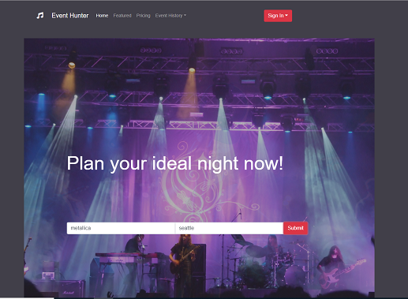
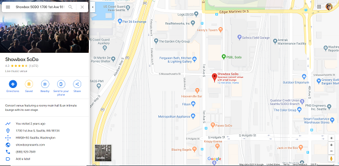
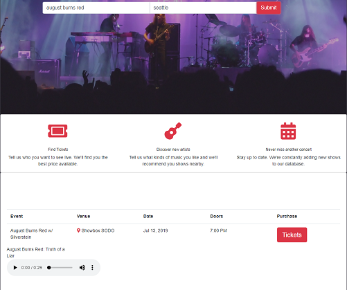
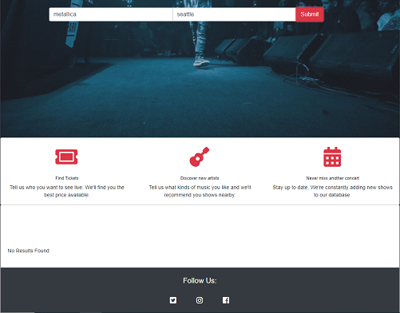
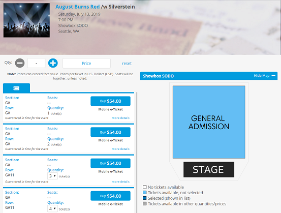
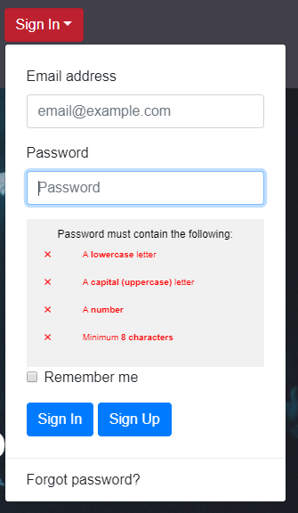

# Event Hunter

## Description

  - A simple and elegant way to search local musical events
  - Users will search artists or genres and the location by city and be returned the data for when the artist that fits the search parameters plays next in your searched city.
  - If no artist is playing the table displays no results found for the user
  - The webpage has a sign in feature supported by Firebase for the users
  - Users will be able to click a google maps icon link for directions as well as a sample audio file for each artist

## Installation

  - clone/run this repo by copying the clone link: 'https://github.com/Pironj/Group-Project-1.git'
  - open up gitbash in your cmd line and run git clone url to location of your choice on your local directory.
  - open the files in your code editor and open in browers

## Technologies Used
  - HTML
  - JavaScript
  - JQuery
  - JSONp
  - TicketMaster API
  - Itunes API

## Future Updates
  
  - storing user search data to their firebase profile
  - updating firebase user authentication from email password to google authenticate for simplicity ease of use
  - adapt google api for model display of directions
  - adding more event types other than music
  - create a date calendar widget to search specified dates

## Contributors

 - (#MarcusSilvus)(#trbradley48)(#benitezmarcos)

## ScreenShot of App

